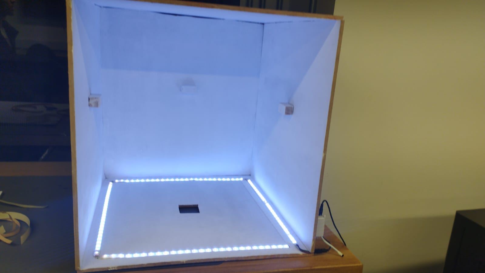

# Capstone
Proyecto de Obtención de colores en muestras de tela y comparacion con otras muestras.

### Poster

<!-- ## Ejemplo de funcionamiento
### Ambiente controlado
Se creó una 'caja' para situar las muestras de tela físicas y digitalizarlas. La caja consta de dos espacios, uno para colocar muestras de hasta 50x50 y el otro para muestras de hasta 30x30. Se pinta el fondo de la imagen en blanco para que sea fácilmente separable la tela del fondo.

### Obtencion de colores
Se toman las fotos de muestras en la aplicación web, de donde se procesa y se obtienen los resultados. Se enseñan ejemplos de imagenes y la comparacion realizada.

Colores de la muestra fisica:
 -->

